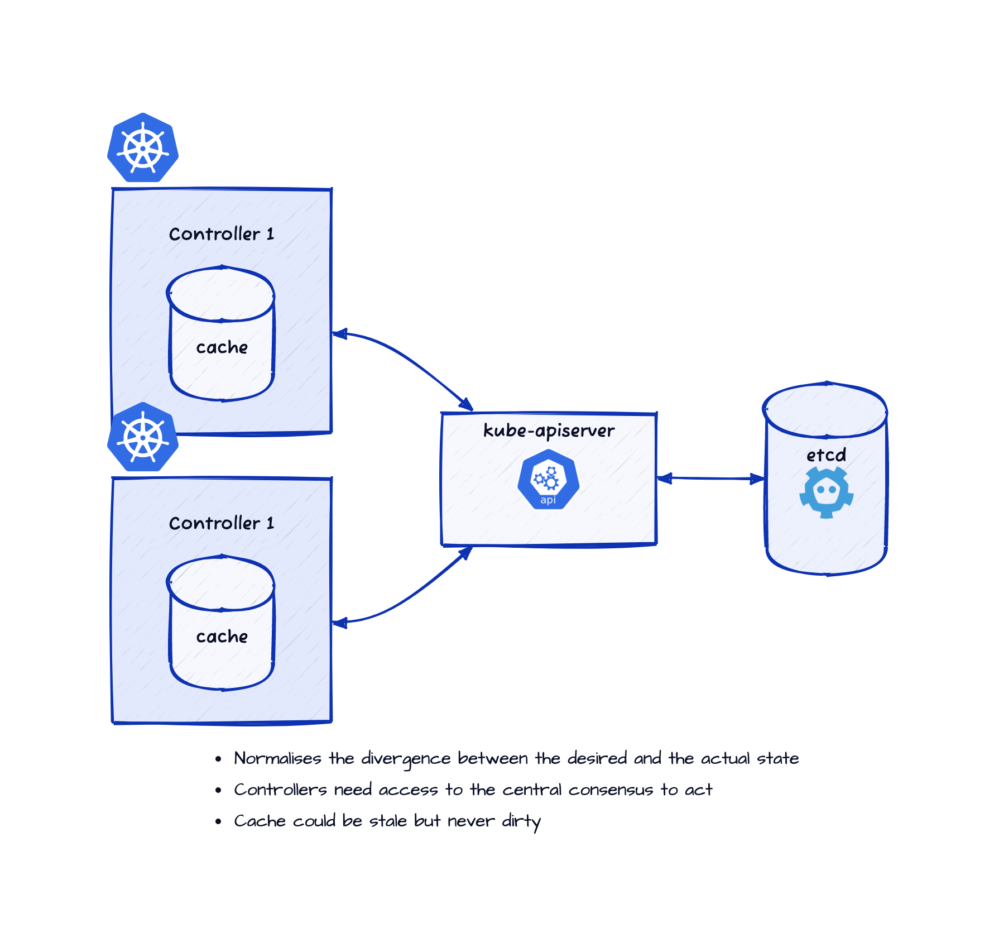
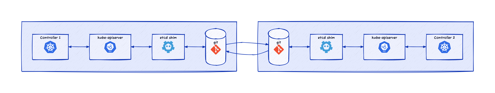

# Trishanku - Fork the Heavens

A set of Kubernetes controllers to configure/provision `trishankuheavens` for Kubernetes controllers.

## Why

[Kubernetes controllers](https://kubernetes.io/docs/concepts/architecture/controller/) are typically control-loops that reconcile some specification
captured in a [Kubernetes objects](https://kubernetes.io/docs/concepts/overview/working-with-objects/kubernetes-objects/) with the corresponding downstream state.
The Kubernetes objects, which capture both the specifications and the status of some object the particular controller is responsible for,
act as a point of coordination between the specification, the status and the action required to reconcile the two.
Typically, the source of specification is external to the particular controller and the controller is responsible
for keeping the status up-to-date and taking actions to reconcile the status with the specification.
The Kubernetes resources are documents hosted on the [`kube-apiserver`](https://kubernetes.io/docs/concepts/overview/components/#kube-apiserver)
which in turn relies on storage components such as [`etcd`](https://kubernetes.io/docs/concepts/overview/components/#etcd).
This architecture is designed to enable [eventual consistency](https://en.wikipedia.org/wiki/Eventual_consistency).

Kubernetes controllers bring automated specialised components close to the way human specialists typically work in the real world.
The [operator pattern](https://kubernetes.io/docs/concepts/extend-kubernetes/operator/) is explicitly modeled after human operators.
But there remains a difference between the human operators and Kubernetes controllers.

### Human Interaction

The ways human operators act and coordinate amongst one another in the real world is eventually consistent (the real world is the ultimate eventually consistent system).

### Coordination amongst Kubernetes Controllers

The way Kubernetes controllers act could be eventually consistent but for coordinating amongst one another there is a central system, namely, the `kube-apiserver`
(or possibly some [extension server](https://kubernetes.io/docs/tasks/extend-kubernetes/configure-aggregation-layer/)).
So, while the individual controllers may be eventually consistent, the coordination between them is
[strongly consistent](https://en.wikipedia.org/wiki/Strong_consistency), or atleast rigidly structured.

It is interesting to think about ways to eliminate this remaining difference between the way humans operators and controllers coordinate, if only as a thought experiment.
But it is quite likely that there are real-world scenarios that might benifit from an
eventually consistent model for coordination between specialised controllers.

### Story

Once upon a time, [Triśaṅku](https://en.wikipedia.org/wiki/Trishanku), a king, wanted to ascend to the heavens while still in his mortal body.
When he requested the sages to perform a [yajña](https://en.wikipedia.org/wiki/Yajna) to make this happen,
he was cursed and disgraced by the sages, including the royal preceptor, sage [Vasiṣṭha](https://en.wikipedia.org/wiki/Vasishtha),
saying that only entering the heavens after shedding the mortal body was [dharma](https://en.wikipedia.org/wiki/Dharma) and doing so before that was not.
Sage [Viśvāmitra](https://en.wikipedia.org/wiki/Vishvamitra), however, agreed to perform the yajña.
As the yajña proceeded, Trishanku starte ascending to the heavens,
but at the gates, he was kicked out by [Indra](https://en.wikipedia.org/wiki/Indra), the king of Gods.
Upon seeing Triśaṅku falling from the heavens head first, Viśvāmitra,
vowed to fullfil his promise to Triśaṅku and proceeded to create an
alternative heavens in the southern sky, where Triśaṅku had fallen,
and install Triśaṅku as the alternative Indra there.
On Indra's pleading, [Bṛhaspati](https://en.wikipedia.org/wiki/Brihaspati), the preceptor of Gods,
managed to convince Viśvāmitra to abandon this project before the universe could fall into chaos,
but on the condition that the nascent alternative heavens around the upside-down Triśaṅku can remain in the southern sky.
The modern-day constellation [Crux](https://en.wikipedia.org/wiki/Crux), also known as the Southern Cross forms part of this abandoned alternative heavens.

#### Summary in programming jargon

Viśvāmitra raised a [pull request](https://en.wikipedia.org/wiki/Distributed_version_control#Pull_requests) (Triśaṅku) to the heavens which was rejected by Indra.
So, Viśvāmitra [forked](https://en.wikipedia.org/wiki/Fork_(software_development)) the heavens.
On pleading from Indra, Brihaspati pursuaded Viśvāmitra to abandon the project,
but not without the changes from the fork being
[merged](https://en.wikipedia.org/wiki/Merge_(version_control)) as a proof of concept for an alternaive approach.

#### Moral of the story

Sometimes it is necessary to fork the heavens.

## What

The problem of eventually consistency for a general class of specialist human operators, namely, computer programmers,
has been solved quite interestingly and successfully by the [`Git`](https://git-scm.com).
Git enables individual computer programmers to work independently (on their own local [clones](https://git-scm.com/docs/git-clone)) at their own pace
and coordinate amongst one another (by [pulling](https://git-scm.com/docs/git-pull) relevant changes) as and when required in a way they find convenient and productive.

### Programmers coordinating using Git

Git does not mandate any particular structure for the coordination-flow; any network of coordination with any degree of simplicity or complexity is supported.
This enables not only groups of programmers to experiment with different coordination-flows and home in the flow that works best for them
but also for a suitable modularity to emerge for the solution to the problem they are trying to solve.

### Kubernetes Controllers coordinating using Git

If Git can be used as the storage layer for the specification and status, the controllers can coordinate amongst themselves (and with human operators)
in the same way computer programmers do, provided there is some additional support for setting up and automation of flexibile network of coordination.

But it is not possible to implement this with binary-compatibility for existing Kubernetes controllers,
though it would be possible with source-compatibility.

#### More complex coordination

Since Git does not mandate any particular way to structure the coordination, it is possible to setup any suitable structure,
for example, via an upstream Git repository as shown above.

#### Binary-compatibility for Kubernetes Controllers

Kubernetes apiserver implementation has a [storage backend abstraction](https://github.com/kubernetes/kubernetes/blob/master/staging/src/k8s.io/apiserver/pkg/storage/interfaces.go).
But to make use of it to use Git as the storage backend would involve making changes to the `kube-apiserver` source code.

##### Binary-compatibility for kube-apiserver

Kubernetes apiserver uses [`etcd`](https://etcd.io) as the default storage backend.
An `etcd` [shim](https://en.wikipedia.org/wiki/Shim_(computing)) that uses
Git for storage can enable binary-compatibility even with `kube-apiserver` while coordinating Kubernetes controllers using Git.

## How

### Gitcd

[Gitcd](https://github.com/trishanku-org/gitcd) is an `etcd` shim that uses a Git repository for storage.
The [`gitcd serve`](https://github.com/trishanku-org/gitcd/blob/main/cmd/serve.go) command serves a Git repository as an `etcd` shim (and continually pull from a remote branch if configured).
The [`gitcd pull`](https://github.com/trishanku-org/gitcd/blob/main/cmd/pull.go) command continually merges the changes from a local branch to a remote branch.

