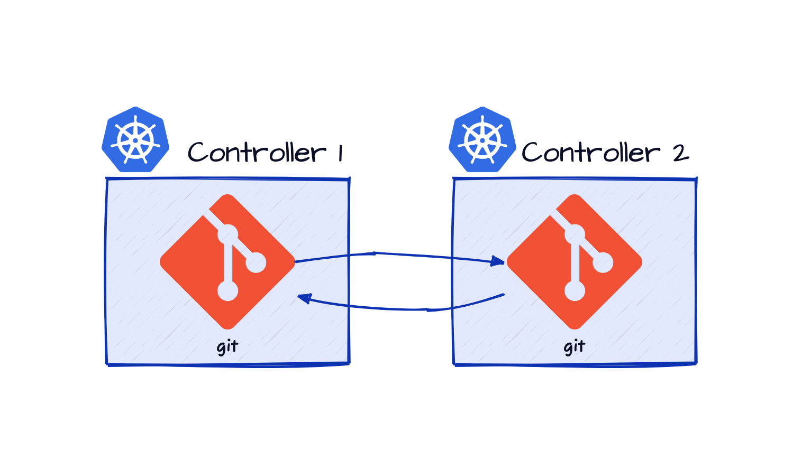
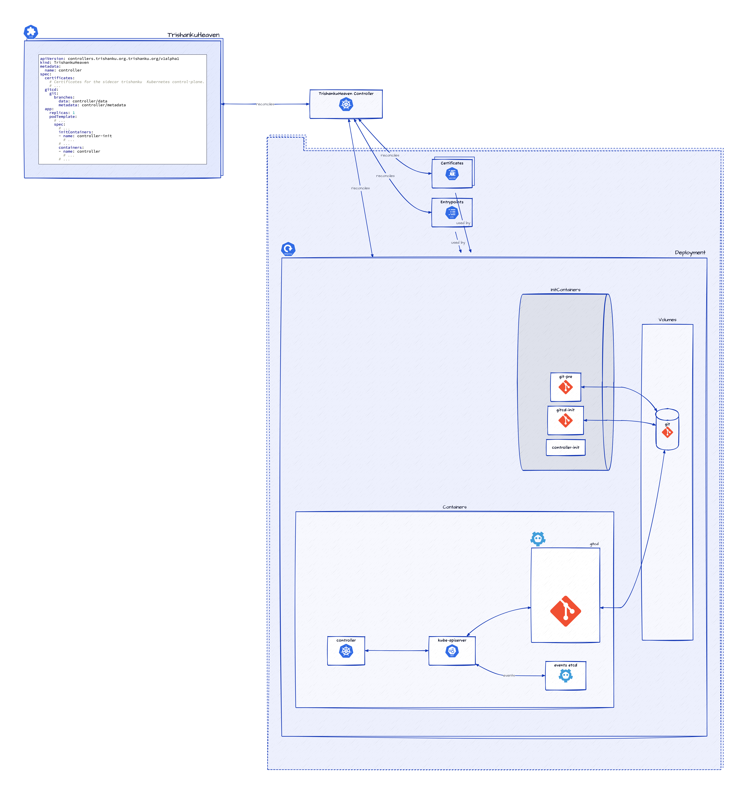

# Trishanku - Fork the Heavens

A set of Kubernetes controllers to configure/provision `trishankuheavens` for Kubernetes controllers.

## Content

- [Trishanku - Fork the Heavens](#trishanku---fork-the-heavens)
- [Content](#content)
- [Why](#why)
  - [Human Interaction](#human-interaction)
  - [Coordination amongst Kubernetes Controllers](#coordination-amongst-kubernetes-controllers)
  - [Story](#story)
    - [Summary in programming jargon](#summary-in-programming-jargon)
    - [Moral of the story](#moral-of-the-story)
- [What](#what)
  - [Programmers coordinating using Git](#programmers-coordinating-using-git)
  - [Kubernetes Controllers coordinating using Git](#kubernetes-controllers-coordinating-using-git)
    - [More complex coordination](#more-complex-coordination)
    - [Binary-compatibility for Kubernetes Controllers](#binary-compatibility-for-kubernetes-controllers)
      - [Binary-compatibility for kube-apiserver](#binary-compatibility-for-kube-apiserver)
- [How](#how)
  - [Gitcd](#gitcd)
  - [TrishankuHeaven](#trishankuheaven)
    - [Coordination using an upstream Git repository](#coordination-using-an-upstream-git-repository)
    - [Headless Kubernetes Cluster](#headless-kubernetes-cluster)

## Why

[Kubernetes controllers](https://kubernetes.io/docs/concepts/architecture/controller/) are typically control-loops that reconcile some specification
captured in a [Kubernetes object](https://kubernetes.io/docs/concepts/overview/working-with-objects/kubernetes-objects/) with the corresponding downstream state.
The Kubernetes objects, which capture both the specifications and the status of some object the particular controller is responsible for,
act as a point of coordination between the specification, the status and the action required to reconcile the two.
Typically, the source of specification is external to the particular controller and the controller is responsible
for keeping the status up-to-date and taking actions to reconcile the status with the specification.
The Kubernetes objects are documents hosted on the [`kube-apiserver`](https://kubernetes.io/docs/concepts/overview/components/#kube-apiserver)
which in turn relies on storage components such as [`etcd`](https://kubernetes.io/docs/concepts/overview/components/#etcd).
This architecture is designed to enable [eventual consistency](https://en.wikipedia.org/wiki/Eventual_consistency).

Kubernetes controllers bring automated specialised components close to the way human specialists typically work in the real world.
The [operator pattern](https://kubernetes.io/docs/concepts/extend-kubernetes/operator/) is explicitly modeled after human operators.
But there remains a difference between the human operators and Kubernetes controllers.

### Human Interaction

The ways human operators act and coordinate amongst one another in the real world is eventually consistent (the real world is the ultimate eventually consistent system).

### Coordination amongst Kubernetes Controllers

The way Kubernetes controllers act could be eventually consistent but for coordinating amongst one another there is a central system, namely, the `kube-apiserver`
(or possibly some [extension server](https://kubernetes.io/docs/tasks/extend-kubernetes/configure-aggregation-layer/)).
So, while the individual controllers may be eventually consistent, the coordination between them is
[strongly consistent](https://en.wikipedia.org/wiki/Strong_consistency), or atleast rigidly structured.

It is interesting to think about ways to eliminate this remaining difference between the way humans operators and controllers coordinate, if only as a thought experiment.
But it is quite likely that there are real-world scenarios that might benifit from an
eventually consistent model for coordination between specialised controllers.

### Story

Once upon a time, [Triśaṅku](https://en.wikipedia.org/wiki/Trishanku), a king, wanted to ascend to the heavens while still in his mortal body.
When he requested the sages to perform a [yajña](https://en.wikipedia.org/wiki/Yajna) to make this happen,
he was cursed and disgraced by them, including the royal preceptor, sage [Vasiṣṭha](https://en.wikipedia.org/wiki/Vasishtha),
saying that only entering the heavens after shedding the mortal body was [dharma](https://en.wikipedia.org/wiki/Dharma) and doing so before that was not.
Sage [Viśvāmitra](https://en.wikipedia.org/wiki/Vishvamitra), however, agreed to perform the yajña.
As the yajña proceeded, Trishanku started ascending to the heavens,
but he was kicked out at the gates by [Indra](https://en.wikipedia.org/wiki/Indra), the king of Gods.
Upon seeing Triśaṅku fall from the heavens head first, Viśvāmitra vowed to fullfil his promise to Triśaṅku and proceeded to create an
alternative heavens in the southern sky (where Triśaṅku had fallen) and install Triśaṅku as the rival Indra there.
On a panicked Indra's pleading, [Bṛhaspati](https://en.wikipedia.org/wiki/Brihaspati), the preceptor of Gods,
managed to convince Viśvāmitra to abandon this project lest the universe fall into chaos,
but on the condition that the nascent alternative heavens around the upside-down Triśaṅku can remain in the southern sky.
The modern-day constellation [Crux](https://en.wikipedia.org/wiki/Crux) (also known as the Southern Cross) forms a part of this abandoned alternative heavens.

#### Summary in programming jargon

Viśvāmitra's [pull request](https://en.wikipedia.org/wiki/Distributed_version_control#Pull_requests) (Triśaṅku) to the heavens was rejected by Indra.
So, Viśvāmitra [forked](https://en.wikipedia.org/wiki/Fork_(software_development)) the heavens.
On pleading from Indra, Brihaspati pursuaded Viśvāmitra to stop working on the fork further,
but not without the existing changes from the fork being
[merged](https://en.wikipedia.org/wiki/Merge_(version_control)) as a proof of concept for an alternative implementation.

#### Moral of the story

Sometimes it is necessary to fork the heavens.

## What

The problem of eventually consistency for a general class of specialist human operators, namely, computer programmers,
has been solved quite interestingly and successfully by the [`Git`](https://git-scm.com).
Git enables individual computer programmers to work independently (on their own local [clones](https://git-scm.com/docs/git-clone)) at their own pace
and coordinate amongst one another (by [pulling](https://git-scm.com/docs/git-pull) relevant changes) as and when required in a way they find convenient and productive.

### Programmers coordinating using Git

Git does not mandate any particular structure for the coordination-flow; any network of coordination with any degree of simplicity or complexity is supported.
This enables not only groups of programmers to experiment with different coordination-flows and home in the flow that works best for them
but also for a suitable modularity to emerge for the solution to the problem they are trying to solve.

### Kubernetes Controllers coordinating using Git

If Git can be used as the storage layer for the specification and status, the controllers can coordinate amongst themselves (and with human operators)
in the same way computer programmers do, provided there is some additional support for setting up and automation of flexibile network of coordination.

But it is not possible to implement this with binary-compatibility for existing Kubernetes controllers,
though it would be possible with source-compatibility.

#### More complex coordination

Since Git does not mandate any particular way to structure the coordination, it is possible to setup any suitable structure,
for example, via an upstream Git repository as shown above.

#### Binary-compatibility for Kubernetes Controllers

Kubernetes apiserver implementation has a [storage backend abstraction](https://github.com/kubernetes/kubernetes/blob/master/staging/src/k8s.io/apiserver/pkg/storage/interfaces.go).
But to make use of it to use Git as the storage backend would involve making changes to the `kube-apiserver` source code.

##### Binary-compatibility for kube-apiserver

Kubernetes apiserver uses [`etcd`](https://etcd.io) as the default storage backend.
An `etcd` [shim](https://en.wikipedia.org/wiki/Shim_(computing)) that uses
Git for storage can enable binary-compatibility even with `kube-apiserver` while coordinating Kubernetes controllers using Git.

## How

### Gitcd

[Gitcd](https://github.com/trishanku-org/gitcd) is an `etcd` shim that uses a Git repository for storage.
The [`gitcd serve`](https://github.com/trishanku-org/gitcd/blob/main/cmd/serve.go) command serves a Git repository as an `etcd` shim (and continually pull from a remote branch if configured).
The [`gitcd pull`](https://github.com/trishanku-org/gitcd/blob/main/cmd/pull.go) command continually merges the changes from a local branch to a remote branch.

### TrishankuHeaven

The `TrishankuHeaven` controller helps setup a `TrishankuHeaven`
in a Kubernetes [`Pod`](https://kubernetes.io/docs/reference/kubernetes-api/workload-resources/pod-v1/),
i.e., coordinate using Git like human computer programmers instead of a centralised Kubernetes control-plane,
for existing Kubernetes controllers with full binary-compatibility declaratively.
The host for the `pod` could be any Kubernetes cluster that the required
network connectivity that the target controller (and possibly the Git-based coordination) requires.

The [`TrishankuHeaven`](https://github.com/trishanku-org/heaven/blob/main/api/v1alpha1/trishankuheaven_types.go) is a Kubernetes [custom resource](https://kubernetes.io/docs/tasks/extend-kubernetes/custom-resources/custom-resource-definitions/),
which captures, in its specification section,
the `PodTemplate` for the Kubernetes controller along with the required Git configuration to be used for co-ordination.
The `TrishankuHeaven` [controller](https://github.com/trishanku-org/heaven/blob/main/controllers/trishankuheaven_controller.go)
then acts on this object to create and maintain a `Deployment` for the controller with the specified `PodTemplate`,
but enhanced with additional containers (initial and normal) to act as a binary-compatible triśaṅku heaven,
so that the controller can continue to work with its own local sidecar `kube-apiserver`, with the other `gitcd` sidecar containers helping with the coordination with the other controllers via Git.

The additional init-containers help prepare the Git repository to be used as a backend for `gitcd`.

- The container `git-pre` initialises or clones the Git repo if necessary.
- The container `gitcd-init` initialises the `gitcd` data and metadata branches in the Git repository.

The additional containers help create a local Kubernetes environment for the target controller which is backed by the Git repository.

- The container `gitcd` acts as an `etcd` shim which is backed by the Git repository.
- The container `kube-apiserver` uses the `gitcd` container as the storage backend and acts as a local Kubernetes control-plane for the target controller.
The target controller is configured to talk to this local `kube-apiserver` instead of the cluster's `kube-apiserver`.
- The container `events-etcd` hosts a single-member `etcd` cluster for the high-traffic and somewhat transient `event` objects,
so that the `gitcd` instance is not overwhelmed.

This way, existing Kubernetes controllers can coordinate amongst one another while working independently without the need for a central control-plane.

#### Coordination using an upstream Git repository

Since Git does not mandate any particular way to structure the coordination, it is possible to setup any suitable structure,
for example, via an upstream Git repository as shown above.

In this scenario, a couple of additional init-containers are used to setup the coordination using the upstream Git repository.

- The container `git-post` pushes the newly initialised `gitcd` data and metadata branches for the `controller` (and possibly the upstream `main` data and metadata branch that act as the point of coordination).
- The container `git-pre-pr` initialises a new clone of the upstream Git repository for the purpose of automatically merging changes
from the `controller` data and metadata branches into the `main` data and metadata branches.

An additional container `gitcd-pr` is also used to continually fetch and merge changes from the `controller` data and metadata branches into the `main` data and metadata branches and push to the upstream Git repository.
The `gitcd` container already fetches and merge the changes continually from the `main` data and metadata branches into the `controller` data and metadata branches and push to the upstream Git repository.
This completes the circle of coordination.
The `gitcd` and `gitcd-pr` controllers use their own clones of the upstream Git repository to avoid the synchronisation burden between them which would be required if they shared the same Git repository.

#### Headless Kubernetes Cluster

This approach for coordinating Kuberenetes controllers without the need for a central control-plane creates the possibility of a full decentralised Kubernetes cluster where each component/controller works independently
while coordinating amongst one another via Git in such a way that the phenomenon of a Kubernetes cluster emerges when without a central control-plane.
Perhaps such a fully decentralised Kubernetes cluster could be called a *headless* Kubernetes cluster.

The step-by-step depiction of setting up such a headless cluster can be seen [here](docs/images/svg/headless-kubernetes/1.svg).

YET TO BE COMPLETED
