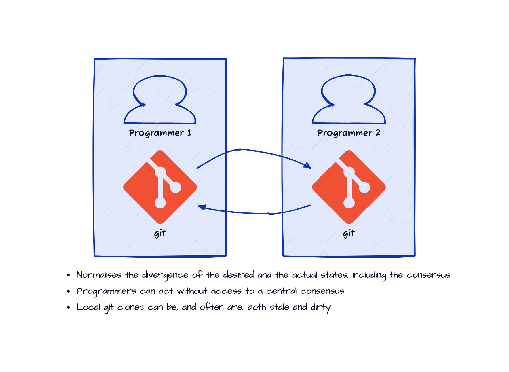
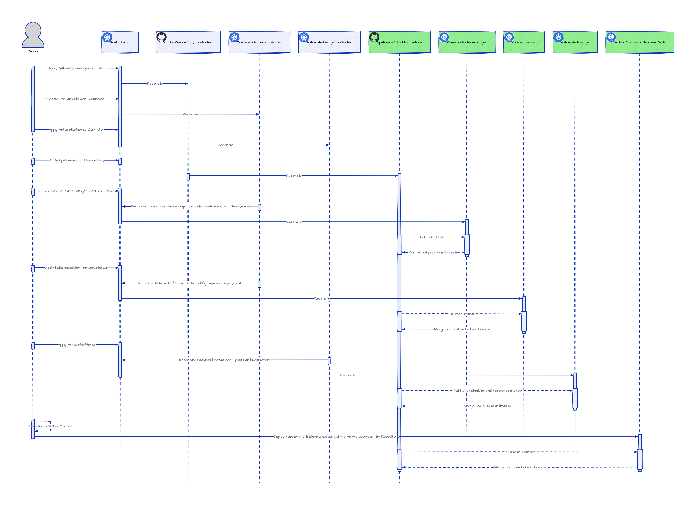
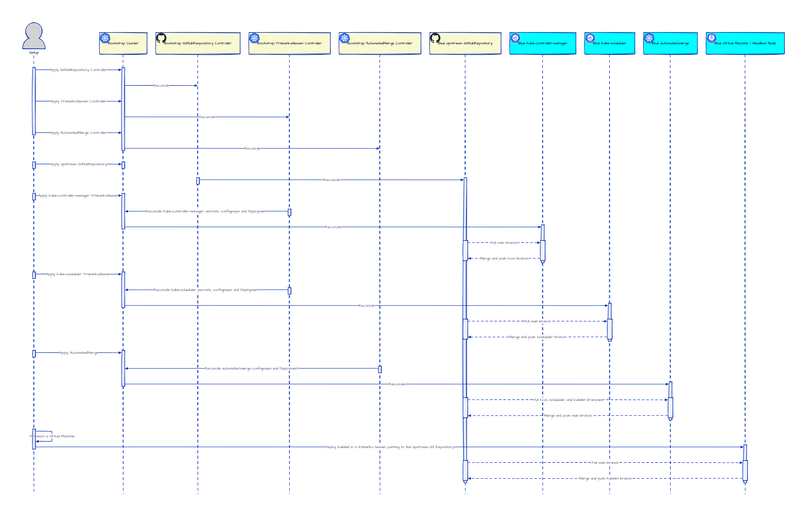
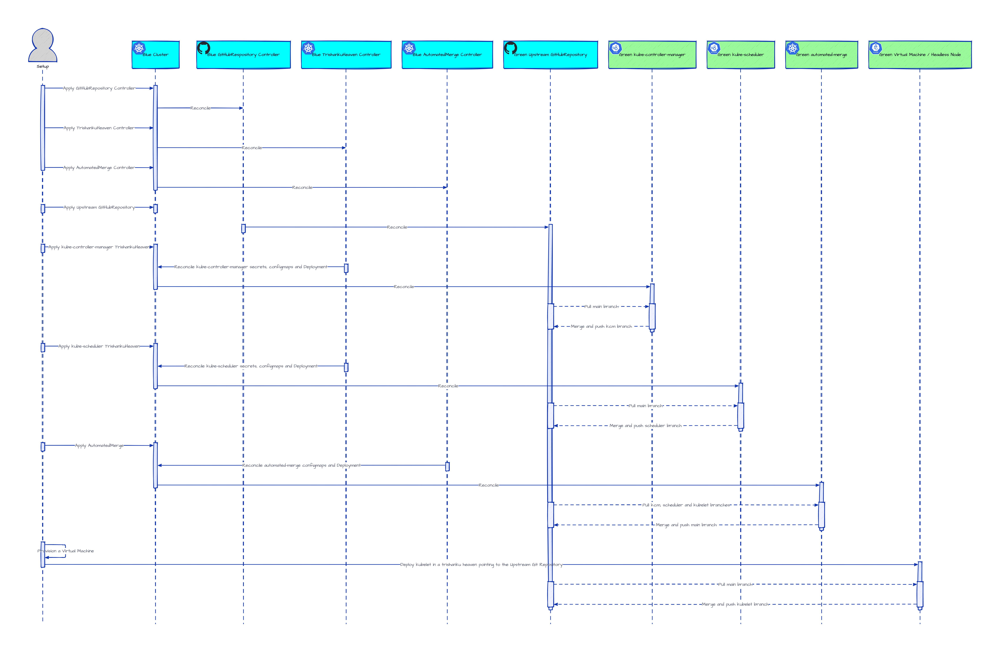
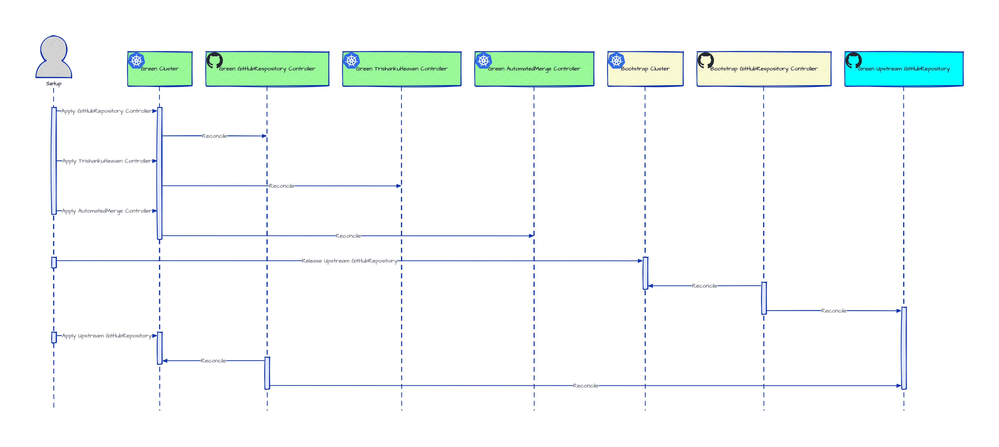
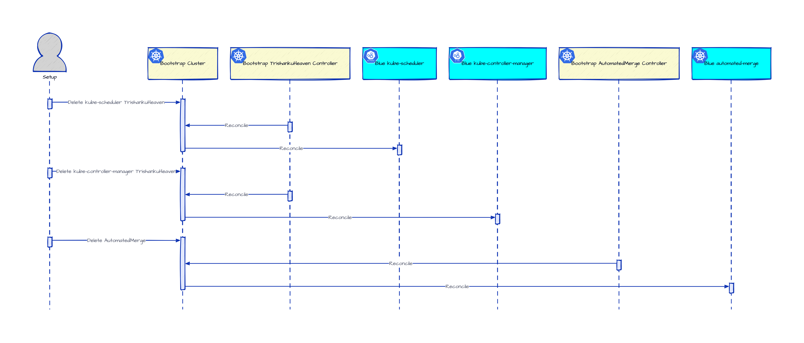
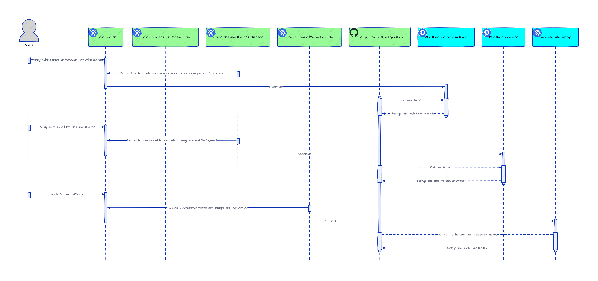
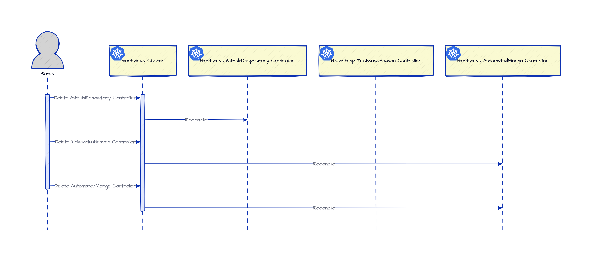

# Trishanku - Fork the Heavens

A set of Kubernetes controllers to configure/provision `trishankuheavens` for Kubernetes controllers.

## Content

- [Trishanku - Fork the Heavens](#trishanku---fork-the-heavens)
- [Content](#content)
- [Why](#why)
  - [Human Interaction](#human-interaction)
  - [Coordination amongst Kubernetes Controllers](#coordination-amongst-kubernetes-controllers)
  - [Story](#story)
    - [Summary in programming jargon](#summary-in-programming-jargon)
    - [Moral of the story](#moral-of-the-story)
- [What](#what)
  - [Programmers coordinating using Git](#programmers-coordinating-using-git)
  - [Kubernetes Controllers coordinating using Git](#kubernetes-controllers-coordinating-using-git)
    - [More complex coordination](#more-complex-coordination)
    - [Binary-compatibility for Kubernetes Controllers](#binary-compatibility-for-kubernetes-controllers)
      - [Binary-compatibility for kube-apiserver](#binary-compatibility-for-kube-apiserver)
- [How](#how)
  - [Gitcd](#gitcd)
  - [TrishankuHeaven](#trishankuheaven)
    - [Coordination using an upstream Git repository](#coordination-using-an-upstream-git-repository)
      - [Note](#note)
    - [Headless Kubernetes Cluster](#headless-kubernetes-cluster)
      - [Note](#note-1)
    - [Two Headless Clusters](#two-headless-clusters)
      - [Note](#note-2)
- [Take It For A Spin](#take-it-for-a-spin)
  - [Pre-requisites](#pre-requisites)
  - [Prepare secrets](#prepare-secrets)
    - [git-cred](#git-cred)
    - [gcp-cred](#gcp-cred)
    - [gar-cred](#gar-cred)
  - [Customise](#customise)
    - [Warning](#warning)
  - [Create A Sample Headless Cluster](#create-a-sample-headless-cluster)
    - [Run The Trishanku Heaven Controller](#run-the-trishanku-heaven-controller)
    - [Apply The Sample Headless Cluster Configuration](#apply-the-sample-headless-cluster-configuration)
    - [Wait Until All The Pods Are Running Or Completed](#wait-until-all-the-pods-are-running-or-completed)
    - [Check That The Configured Private Repo Has The Branches Of All The Controllers](#check-that-the-configured-private-repo-has-the-branches-of-all-the-controllers)
    - [Check The Compute Instance Created By The Machine Controller Manager](#check-the-compute-instance-created-by-the-machine-controller-manager)
  - [Cleanup The Sample Headless Cluster](#cleanup-the-sample-headless-cluster)
    - [Delete The Compute Instance Created By The Machine Controller Manager](#delete-the-compute-instance-created-by-the-machine-controller-manager)
- [Next](#next)
  - [Alternatives to Git](#alternatives-to-git)

## Why

[Kubernetes controllers](https://kubernetes.io/docs/concepts/architecture/controller/) are typically control-loops that reconcile some specification
captured in a [Kubernetes object](https://kubernetes.io/docs/concepts/overview/working-with-objects/kubernetes-objects/) with the corresponding downstream state.
The Kubernetes objects, which capture both the specifications and the status of some object the particular controller is responsible for,
act as a point of coordination between the specification, the status and the action required to reconcile the two.
Typically, the source of specification is external to the particular controller and the controller is responsible
for keeping the status up-to-date and taking actions to reconcile the status with the specification.
The Kubernetes objects are documents hosted on the [`kube-apiserver`](https://kubernetes.io/docs/concepts/overview/components/#kube-apiserver)
which in turn relies on storage components such as [`etcd`](https://kubernetes.io/docs/concepts/overview/components/#etcd).
This architecture is designed to enable [eventual consistency](https://en.wikipedia.org/wiki/Eventual_consistency).

Kubernetes controllers bring automated specialised components close to the way human specialists typically work in the real world.
The [operator pattern](https://kubernetes.io/docs/concepts/extend-kubernetes/operator/) is explicitly modeled after human operators.
But there remains a difference between the human operators and Kubernetes controllers.

### Human Interaction


The ways human operators act and coordinate amongst one another in the real world is eventually consistent (the real world is the ultimate eventually consistent system).

### Coordination amongst Kubernetes Controllers


The way Kubernetes controllers act could be eventually consistent but for coordinating amongst one another there is a central system, namely, the `kube-apiserver`
(or possibly some [extension server](https://kubernetes.io/docs/tasks/extend-kubernetes/configure-aggregation-layer/)).
So, while the individual controllers may be eventually consistent, the coordination between them is
[strongly consistent](https://en.wikipedia.org/wiki/Strong_consistency), or atleast rigidly structured.

It is interesting to think about ways to eliminate this remaining difference between the way humans operators and controllers coordinate, if only as a thought experiment.
But it is quite likely that there are real-world scenarios that might benifit from an
eventually consistent model for coordination between specialised controllers.

### Story

Once upon a time, [Triśaṅku](https://en.wikipedia.org/wiki/Trishanku), a king, wanted to ascend to the heavens while still in his mortal body.
When he requested the sages to perform a [yajña](https://en.wikipedia.org/wiki/Yajna) to make this happen,
he was cursed and disgraced by them, including the royal preceptor, sage [Vasiṣṭha](https://en.wikipedia.org/wiki/Vasishtha),
saying that only entering the heavens after shedding the mortal body was [dharma](https://en.wikipedia.org/wiki/Dharma) and doing so before that was not.
Sage [Viśvāmitra](https://en.wikipedia.org/wiki/Vishvamitra), however, agreed to perform the yajña.
As the yajña proceeded, Trishanku started ascending to the heavens,
but he was kicked out at the gates by [Indra](https://en.wikipedia.org/wiki/Indra), the king of Gods.
Upon seeing Triśaṅku fall from the heavens head first, Viśvāmitra vowed to fullfil his promise to Triśaṅku and proceeded to create an
alternative heavens in the southern sky (where Triśaṅku had fallen) and install Triśaṅku as the rival Indra there.
On a panicked Indra's pleading, [Bṛhaspati](https://en.wikipedia.org/wiki/Brihaspati), the preceptor of Gods,
managed to convince Viśvāmitra to abandon this project lest the universe fall into chaos,
but on the condition that the nascent alternative heavens around the upside-down Triśaṅku can remain in the southern sky.
The modern-day constellation [Crux](https://en.wikipedia.org/wiki/Crux) (also known as the Southern Cross) forms a part of this abandoned alternative heavens.

#### Summary in programming jargon

Viśvāmitra's [pull request](https://en.wikipedia.org/wiki/Distributed_version_control#Pull_requests) (Triśaṅku) to the heavens was rejected by Indra.
So, Viśvāmitra [forked](https://en.wikipedia.org/wiki/Fork_(software_development)) the heavens.
On pleading from Indra, Brihaspati pursuaded Viśvāmitra to stop working on the fork further,
but not without the existing changes from the fork being
[merged](https://en.wikipedia.org/wiki/Merge_(version_control)) as a proof of concept for an alternative implementation.

#### Moral of the story

Sometimes it is necessary to fork the heavens.

## What

The problem of eventually consistency for a general class of specialist human operators, namely, computer programmers,
has been solved quite interestingly and successfully by the [`Git`](https://git-scm.com).
Git enables individual computer programmers to work independently (on their own local [clones](https://git-scm.com/docs/git-clone)) at their own pace
and coordinate amongst one another (by [pulling](https://git-scm.com/docs/git-pull) relevant changes) as and when required in a way they find convenient and productive.

### Programmers coordinating using Git



Git does not mandate any particular structure for the coordination-flow; any network of coordination with any degree of simplicity or complexity is supported.
This enables not only groups of programmers to experiment with different coordination-flows and home in the flow that works best for them
but also for a suitable modularity to emerge for the solution to the problem they are trying to solve.

### Kubernetes Controllers coordinating using Git


If Git can be used as the storage layer for the specification and status, the controllers can coordinate amongst themselves (and with human operators)
in the same way computer programmers do, provided there is some additional support for setting up and automation of flexibile network of coordination.

But it is not possible to implement this with binary-compatibility for existing Kubernetes controllers,
though it would be possible with source-compatibility.

#### More complex coordination


Since Git does not mandate any particular way to structure the coordination, it is possible to setup any suitable structure,
for example, via an upstream Git repository as shown above.

#### Binary-compatibility for Kubernetes Controllers


Kubernetes apiserver implementation has a [storage backend abstraction](https://github.com/kubernetes/kubernetes/blob/master/staging/src/k8s.io/apiserver/pkg/storage/interfaces.go).
But to make use of it to use Git as the storage backend would involve making changes to the `kube-apiserver` source code.

##### Binary-compatibility for kube-apiserver


Kubernetes apiserver uses [`etcd`](https://etcd.io) as the default storage backend.
An `etcd` [shim](https://en.wikipedia.org/wiki/Shim_(computing)) that uses
Git for storage can enable binary-compatibility even with `kube-apiserver` while coordinating Kubernetes controllers using Git.

## How

### Gitcd

[Gitcd](https://github.com/trishanku-org/gitcd) is an `etcd` shim that uses a Git repository for storage.
The [`gitcd serve`](https://github.com/trishanku-org/gitcd/blob/main/cmd/serve.go) command serves a Git repository as an `etcd` shim (and continually pull from a remote branch if configured).
The [`gitcd pull`](https://github.com/trishanku-org/gitcd/blob/main/cmd/pull.go) command continually merges the changes from a local branch to a remote branch.


### TrishankuHeaven

The `TrishankuHeaven` controller helps setup a `TrishankuHeaven`
in a Kubernetes [`Pod`](https://kubernetes.io/docs/reference/kubernetes-api/workload-resources/pod-v1/),
i.e., coordinate using Git like human computer programmers instead of a centralised Kubernetes control-plane,
for existing Kubernetes controllers with full binary-compatibility declaratively.
The host for the `pod` could be any Kubernetes cluster that the required
network connectivity that the target controller (and possibly the Git-based coordination) requires.

The [`TrishankuHeaven`](api/v1alpha1/trishankuheaven_types.go) is a Kubernetes [custom resource](https://kubernetes.io/docs/tasks/extend-kubernetes/custom-resources/custom-resource-definitions/),
which captures, in its specification section,
the `PodTemplate` for the Kubernetes controller along with the required Git configuration to be used for co-ordination.
The `TrishankuHeaven` [controller](https://github.com/trishanku-org/heaven/blob/main/controllers/trishankuheaven_controller.go)
then acts on this object to create and maintain a `Deployment` for the controller with the specified `PodTemplate`,
but enhanced with additional containers (initial and normal) to act as a binary-compatible triśaṅku heaven,
so that the controller can continue to work with its own local sidecar `kube-apiserver`, with the other `gitcd` sidecar containers helping with the coordination with the other controllers via Git.


The additional init-containers help prepare the Git repository to be used as a backend for `gitcd`.

- The container `git-pre` initialises or clones the Git repo if necessary.
- The container `gitcd-init` initialises the `gitcd` data and metadata branches in the Git repository.

The additional containers help create a local Kubernetes environment for the target controller which is backed by the Git repository.

- The container `gitcd` acts as an `etcd` shim which is backed by the Git repository.
- The container `kube-apiserver` uses the `gitcd` container as the storage backend and acts as a local Kubernetes control-plane for the target controller.
The target controller is configured to talk to this local `kube-apiserver` instead of the cluster's `kube-apiserver`.
- The container `events-etcd` hosts a single-member `etcd` cluster for the high-traffic and somewhat transient `event` objects,
so that the `gitcd` instance is not overwhelmed.

This way, existing Kubernetes controllers can coordinate amongst one another while working independently without the need for a central control-plane.

#### Coordination using an upstream Git repository


Since Git does not mandate any particular way to structure the coordination, it is possible to setup any suitable structure,
for example, via an upstream Git repository as shown above.

In this scenario, a couple of additional init-containers are used to setup the coordination using the upstream Git repository.

- The container `git-post` pushes the newly initialised `gitcd` data and metadata branches for the `controller` (and possibly the upstream `main` data and metadata branch that act as the point of coordination).
- The container `git-pre-pr` initialises a new clone of the upstream Git repository for the purpose of automatically merging changes
from the `controller` data and metadata branches into the `main` data and metadata branches.

An additional container `gitcd-pr` is also used to continually fetch and merge changes from the `controller` data and metadata branches into the `main` data and metadata branches and push to the upstream Git repository.
The `gitcd` container already fetches and merge the changes continually from the `main` data and metadata branches into the `controller` data and metadata branches and push to the upstream Git repository.
This completes the circle of coordination.
The `gitcd` and `gitcd-pr` controllers use their own clones of the upstream Git repository to avoid the synchronisation burden between them which would be required if they shared the same Git repository.

##### Note

The additional container `gitcd-pr` used to automate the merging of changes from the controller into the upstream repository has now been replaced with
the [`AutomatedMerge`](api/v1alpha1/automatedmerge_types.go) resource which generates a separate `Deployment` for this purpose.
This redesign was to help co-ordinate changes flowing into any upstream branch which might become a bottleneck.
It also provides maximal flexibility in designing the change-flow between the controllers
(from a central upstream branch to completely decentralised branches pulling changes from each other).

#### Headless Kubernetes Cluster

This approach for coordinating Kuberenetes controllers without the need for a central control-plane creates the possibility of a fully decentralised Kubernetes cluster where each component/controller works independently
while coordinating amongst one another via Git in such a way that the phenomenon of a Kubernetes cluster emerges when without a central control-plane.
Perhaps such a fully decentralised Kubernetes cluster could be called a *headless* Kubernetes cluster.


The individual steps of setting up such a headless cluster can be seen [here](docs/images/svg/headless-kubernetes).

A simplified sequence diagram of the same steps can be seen below.


##### Note

- The above setup assumes the network connectivity between the headless control-plane and the headless worker nodes if it is required.
Ideally, each the headless component (control-plane and worker nodes) needs network access only to the upstream Git repository
apart from what it needs to perform its duties normally.

- The above setup leaves out the details of setting up the headeless virtual machine and making sure that it joins as a node of the headless cluster.
Ideally, this should also be automated declaratively in a control-loop along the lines of [gardener/machine-controller-manager](https://github.com/gardener/machine-controller-manager),
which also can be hosted as another headless control-plane controller in the bootstrap cluster.

#### Two Headless Clusters

The above example used a host Kubernetes cluster to host the headless control-plane for the headless cluster.
Alternatively, two headless clusters could be configured to host the
headless control-planes of each other
(or three headless clusters hosting the control-planes of one another as seen in [this proposa](https://github.com/gardener/gardener/issues/233)).
The high level steps for this can be as below.

1. Setup a `blue` headless cluster using a `bootstrap` Kubernetes cluster to host its headless control-plane.



1. Setup a `green` headless cluster using the `blue` headless cluster to host its headless control-plane.



1. Prepare the `green` headless cluster to host a new replica of the `blue` headless control-plane.



1. Scale down the original `blue` headless control-plane replica in the `bootstrap` cluster to avoid racing with the new replica to be setup next in the `green` headless cluster.



1. Setup the new replica of the `blue` headless control-plane in the `green` headless cluster by pointing the corresponding `trishankuheavens` to the `blue` upstream Git repository.



1. Release the `bootstrap` cluster.



##### Note

- In these depictions, the headless controllers are shown simplistically communicating with the upstream Git repositories (instead of a central apiserver) omitting the details of the sidecar containers or [separate `deployments`](#note) that make such communication happen.
- As mentioned [above](#note-1), this setup leaves out control-loop automation of provisioning headless nodes for either of the headless clusters.
So, this setup is not self-healing if either of the headless nodes are lost.
This can be remedied by setting up something like [`gardener/machine-controller-manager`](https://github.com/gardener/machine-controller-manager).
  - The [sample setup](config/samples) shows how the `gardener/machine-controller-manager` can be setup in such a headless Kubernetes cluster.
  More work is needed to configure the `TrishankuHeaven` for the `kubelet` running in the provisioned machines so that it can join the headless cluster as a `node`.
as a headless control-plane component to provision and manage the headless nodes.
- This setup also ignores the complications involved in transitioning the control-plane of the `blue` headless cluster from the `bootstrap` cluster to the `green` headless cluster.
Such a transition is eased considerably by the fact that merely pointing the `blue` headless cluster's control-plane to the same upstream Git repo solves the data migration problem.
Leader-election or other such mechanisms would be required to aviod/mitigate two replicas of the `blue` headless cluster (one each in the `bootstrap` and `green` clusters) racing with each other.

## Take It For A Spin

### Pre-requisites

1. A GitHub account with a [personal access token](https://docs.github.com/en/authentication/keeping-your-account-and-data-secure/managing-your-personal-access-tokens) with permission to create private repos and push and pull from them.
2. A GCP accound with a [service account](https://cloud.google.com/iam/docs/service-account-overview) with access to create compute instances.
3. A Kubernetes cluster with access to GitHub and GCP API endpoints.

### Prepare secrets

#### git-cred

The secret `git-cred` should contain the personal access token details for access to the GitHub account to create a private repo and push and pull from it.
The secret should have the following information.

- `data.url`: The base URL for the GitHub account.
- `data.username`: The username for the GitHub account.
- `data.password`: The GitHub personal access token.

#### gcp-cred

The secret `gcp-cred` should contain the service token JSON for the GCP account where the compute instance will be created by MCM of the headless cluster.
The secret should have the following information.

- `data.serviceAccountJSON`: The GCP service account JSON with access to create compute instances.
- `data.userData`: The user data to be passed in the GCP compute instance creation request.
Ideally, this should be configured to setup the `kubelet` in the compute instance to join the headless cluster as a `node`.
The work for such configuration is pending.
For now, an empty user data such as `#cloud-config` would do.
With this, the compute instance will be provisioned by it will not join the headless cluster as a `node`.

#### gar-cred

The container images for the `trishanku` components such as [`gitcd`](../gitcd/), [`heaven`](.)
(or for that matter the gardener components like [`gardener/machine-controller-manager`](https://github.com/gardener/machine-controller-manager)
and [`gardener/machine-controller-manager-provider-gcp`](https://github.com/gardener/machine-controller-manager-provider-gcp))
are not available publicly.
So, the images might have to be built from source and pushed a suitable container image registry by customizing the image variable specified in the correspnding `Makefile` in these projects before running `make docker-build` or `make docker-image` before pushing the docker image.

If the selected container image registry requires access permission to pull images from, such access permissions need to be specified in a secret `gar-cred`
so that the sidecar containers created for the `trishankuheavens` can pull these images.

### Customise

The sample YAML files create a [private GitHub repo](config/samples) `sample-k8s` under the GitHub organisation `trishanku-org`.
If this is to be customised, the changes have to be done consistently in all the YAML files.

#### Warning

Since, all the controllers in the headless cluster, including the `gardener/machine-controller-manager` controllers,
use the above-mentioned private repo as the co-ordination point for their individual Git repos,
the secret `gcp-cred` gets copied into this private repo.
So, it is important to keep even a customised repo as a private repo (and to delete the repo after this exercise) to avoid leaking GCP credentials.

### Create A Sample Headless Cluster

#### Run The Trishanku Heaven Controller

Please make sure to clone the trishanku `heaven`(.) repo and to `cd` into the cloned directory before proceeding.
Also, please make sure that the `KUBECONFIG` is pointing to the chosen Kubernetes cluster.

```sh
make run &
```

Alternatively, please run the trishanku `heaven` as a controller in a pod in the cluster with the [required permissions](config/rbac/role.yaml).

#### Apply The Sample Headless Cluster Configuration

```sh
$ kubectl apply -f config/samples
automatedmerge.controllers.trishanku.org.trishanku.org/sample-k8s-kcm created
githubrepository.controllers.trishanku.org.trishanku.org/sample-k8s created
trishankuheaven.controllers.trishanku.org.trishanku.org/sample-k8s created
trishankuheaven.controllers.trishanku.org.trishanku.org/sample-k8s-kcm created
trishankuheaven.controllers.trishanku.org.trishanku.org/sample-k8s-kube-scheduler created
configmap/sample-k8s-kube-scheduler created
serviceaccount/sample-k8s-mcm-crds created
role.rbac.authorization.k8s.io/sample-k8s-mcm-crds created
rolebinding.rbac.authorization.k8s.io/sample-k8s-mcm-crds created
job.batch/sample-k8s-mcm-crds created
configmap/sample-k8s-mcm-crds-entrypoint created
trishankuheaven.controllers.trishanku.org.trishanku.org/sample-k8s-mcm created
trishankuheaven.controllers.trishanku.org.trishanku.org/sample-k8s-mc created
```

#### Wait Until All The Pods Are Running Or Completed

```sh
$ wait kubectl get pods
NAME                                               READY   STATUS      RESTARTS   AGE
sample-k8s-kcm-automerge-554c8fff8f-8kgwv          1/1     Running     0          2m9s
sample-k8s-kcm-heaven-7d4f66667f-w9x79             4/4     Running     0          2m15s
sample-k8s-kube-scheduler-heaven-b6459f8d7-jlbfc   4/4     Running     0          32s
sample-k8s-mc-heaven-7ffc78d454-lr7q2              4/4     Running     0          2m15s
sample-k8s-mcm-crds-swl6m                          0/1     Completed   2          2m16s
sample-k8s-mcm-heaven-7499c45fff-mng2x             4/4     Running     0          2m15s
```

This might take a couple of minutes.

#### Check That The Configured Private Repo Has The Branches Of All The Controllers


#### Check The Compute Instance Created By The Machine Controller Manager

```sh
# Please make sure to authenticate gcloud to the right GCP account and to customise the region and zone correctly.
$ gcloud compute instances list
NAME          ZONE           MACHINE_TYPE   PREEMPTIBLE  INTERNAL_IP  EXTERNAL_IP    STATUS
test-machine  asia-south1-a  n1-standard-1               10.160.0.6   34.93.143.120  RUNNING
```

### Cleanup The Sample Headless Cluster

```sh
$ kubectl delete -f config/samples
automatedmerge.controllers.trishanku.org.trishanku.org "sample-k8s-kcm" deleted
githubrepository.controllers.trishanku.org.trishanku.org "sample-k8s" deleted
trishankuheaven.controllers.trishanku.org.trishanku.org "sample-k8s" deleted
trishankuheaven.controllers.trishanku.org.trishanku.org "sample-k8s-kcm" deleted
trishankuheaven.controllers.trishanku.org.trishanku.org "sample-k8s-kube-scheduler" deleted
configmap "sample-k8s-kube-scheduler" deleted
serviceaccount "sample-k8s-mcm-crds" deleted
role.rbac.authorization.k8s.io "sample-k8s-mcm-crds" deleted
rolebinding.rbac.authorization.k8s.io "sample-k8s-mcm-crds" deleted
job.batch "sample-k8s-mcm-crds" deleted
configmap "sample-k8s-mcm-crds-entrypoint" deleted
trishankuheaven.controllers.trishanku.org.trishanku.org "sample-k8s-mcm" deleted
trishankuheaven.controllers.trishanku.org.trishanku.org "sample-k8s-mc" deleted
```

#### Delete The Compute Instance Created By The Machine Controller Manager

The steps for deprovisioning of the compute instance created by the `gardener/machine-controller-manager` is yet to be updated in this documentation.
For the time-being, please deprovision the compute instance via `gcloud` command.

```sh
# Please make sure to authenticate gcloud to the right GCP account and to customise the region and zone correctly.
$ gcloud compute instances delete test-machine --zone asia-south1-a
The following instances will be deleted. Any attached disks configured to be auto-deleted will be deleted unless they are
attached to any other instances or the `--keep-disks` flag is given and specifies them for keeping. Deleting a disk is
irreversible and any data on the disk will be lost.
 - [test-machine] in [asia-south1-a]

Do you want to continue (Y/n)?  Y

Deleted [https://www.googleapis.com/compute/v1/projects/trishanku/zones/asia-south1-a/instances/test-machine].
```

## Next

This project is a proof of concept.
As [noted above](#note-2), the sample setup sets up a headless Kubernetes cluster with the `kube-controller-manager`, the `kube-scheduler` and the controllers of the
`gardener/machine-controller-manager` to run independently while co-ordinating with one another only by communicating changes via Git.

- Work is pending to configure a `TrishankuHeaven` for the `kubelet` inside the machines provisioned by the `gardener/machine-controller-manager` to help it join and participate in the headless cluster as a `node`.
- Also, a lot more work is required to make it efficient and productive.

The [above sample](#take-it-for-a-spin) uses a private GitHub repo as a point of co-ordination amongst the controllers of a headless cluster.

- It is possible to do such a co-ordination with a locally accessible Git repo but working is pending to document this.
- Work is also pending to support other Git-hosting platforms.

There are different possible applications for such an approach of
loosely co-ordinating independent controllers.
Please reach out at [@AmshumanKR](https://twitter.com/AmshumanKR) (Twitter) or here in the GitHub [issues](https://github.com/trishanku-org/heaven/issues) if interested in collaborating.

### Alternatives to Git

Git was picked for this project because it enables unlimited forking and multi-way merging with unconstrained conflict resolution.
But the inefficiency of using Git as a database is obvious
(though seeing the history of change made by the individual controller can be quite interesting in itself and might even have some diagnostic value).
Some of the inefficiency is mitigated by the fact that each fork of the Git repo serves only a single controller and the eventually consistent coordination
naturally lends itself to subdividing the problem space (and hence, the data space) to any suitable granularity.

However, the real inefficiency lies in Gitcd using a file/folder structure as a key-value store
and not so much in Git being used to version track such a file/folder structure.
In principle, this can be remedied by using a more conventional database which supports eventually consistent coordination
with unlimited forks and multi-way merging the way Git does.
Some candidates are as follows.

- [Dolt](https://github.com/dolthub/dolt)
- [Irmin](https://github.com/mirage/irmin)
- [TerminusDB](https://github.com/terminusdb/terminusdb)
